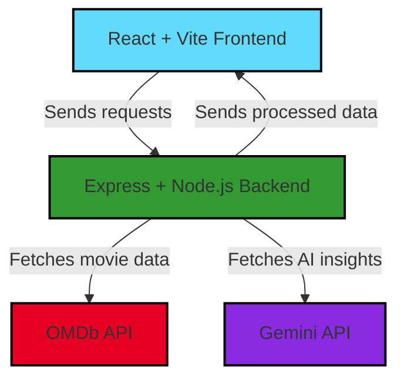

<!-- HEADER BANNER -->
<!-- HEADER BANNER -->
<p align="center">
  
</p>


<p align="center">
  
  
  
  
  
  
</p>  

<p align="center">
  <strong>Discover trending, top-rated, and upcoming movies with AI-powered insights.</strong><br/>
  Built using <b>React + Vite</b> on the frontend and <b>Express + Node.js</b> on the backend.
</p>

<p align="center">
  🔗 <a href="https://moviesfront-q1wi.onrender.com" target="_blank"><strong>Live Demo</strong></a>
</p>

---

## 🎞️ UI Previews

<table>
  <tr>
    <td>
      
    </td>
    <td>
      
    </td>
  </tr>
</table>

---

## ✨ Features

- 🎥 **Real-time Movie Discovery:** Powered by OMDb + Gemini AI
- 🤖 **AI-Powered Insights:** Get recommendations, summaries, and more from Gemini API
- 🔍 **Smart Search & Filtering:** Explore by genre, rating, and more
- ⚡ **Lightning Fast UI:** Built on React + Vite for blazing speed
- 📱 **Mobile First:** Fully responsive, beautiful on any device
- 🌐 **REST API Backend:** Scalable and robust Express server

---

## 🛠️ Tech Stack

| Frontend              | Backend                | Integrations         |
|:---------------------:|:---------------------:|:-------------------:|
| ⚛️ React (Vite)       | 🖥️ Node.js + Express  | 🎬 OMDb API         |
| 🎨 Tailwind CSS       | 🗃️ RESTful API        | 🤖 Gemini API       |


---

## 🗺️ Architecture Flow



---

## 🌐 Project Structure

```shell
moviescameo/
 ├─ client/      # React + Vite + Tailwind (Frontend)
 ├─ server/      # Node.js + Express (Backend)
 └─ README.md
```

---

## ⚡ Quickstart

```bash
# 1. Clone
git clone https://github.com/<your-username>/moviescameo.git && cd moviescameo

# 2. Install dependencies
cd client && npm i
cd ../server && npm i

# 3. Configure .env in both folders (API keys for OMDb and Gemini)

# 4. Run
cd client && npm run dev
cd ../server && npm run dev
```

---

## 💡 Inspired By

> 

---

